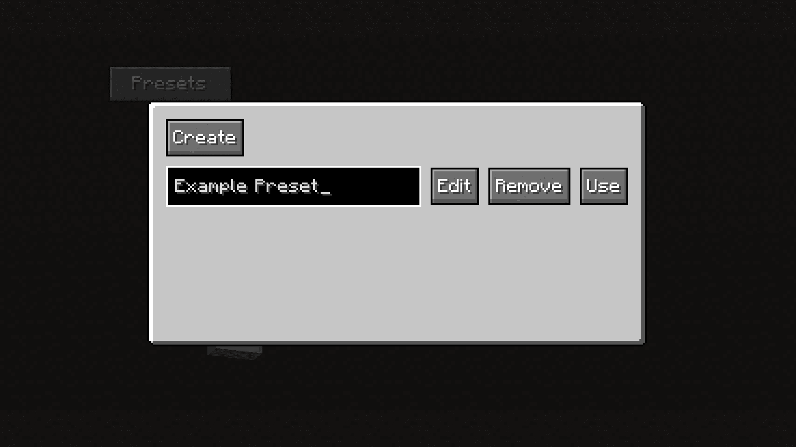
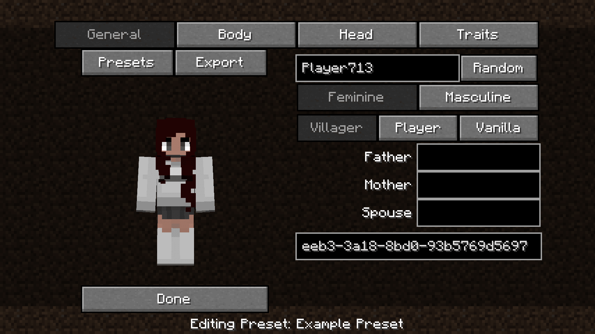
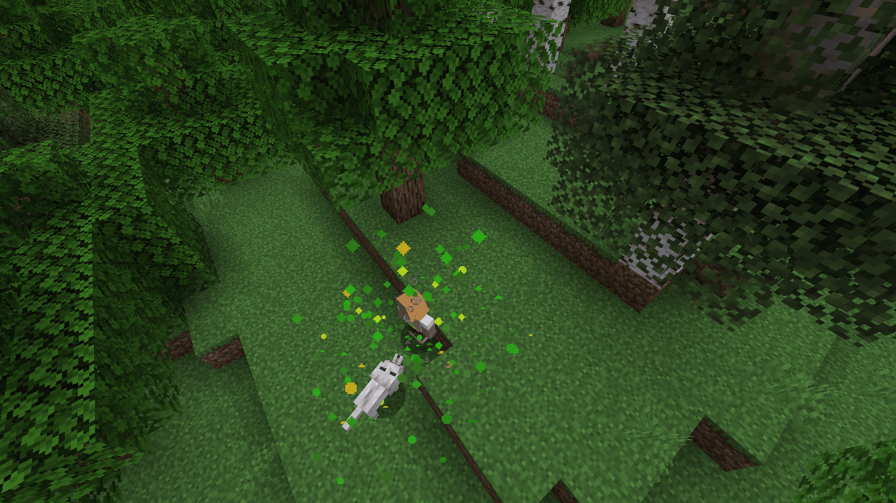

# MCA Expanded

An addon for [MCA Reborn](https://modrinth.com/mod/minecraft-comes-alive-reborn) that adds several QoL features

- [MCA Expanded](#mca-expanded)
  - [Features](#features)
    - [Villager Model Presets](#villager-model-presets)
    - [Exporting Villager Models](#exporting-villager-models)
    - [Disabling the Destiny Screen](#disabling-the-destiny-screen)
    - [Totems of Undying](#totems-of-undying)

## Features

- Presets for villager models
- Export villager models as skins
- Disable the destiny screen
- Villagers use totems of undying in their inventory

### Villager Model Presets

You can use or edit villager presets in the villager editor screen by clicking on the "Presets" button. Alternatively, if you have Mod Menu installed, you can edit villager presets from the Mod Menu page.

*The screen that appears when the preset button is clicked*

*The preset editor screen*

### Exporting Villager Models

You can export villager models as skins by clicking on the "Export" button. It will export the model as a regular Minecraft skin that you can use.

### Disabling the Destiny Screen

In the Mod Menu screen, you may disable the destiny screen that appears after the character editor when you create a world or join one for the first time.

### Totems of Undying

If a villager is given a totem of undying, it will equip it right before it's about to die.

*A villager using a totem*
